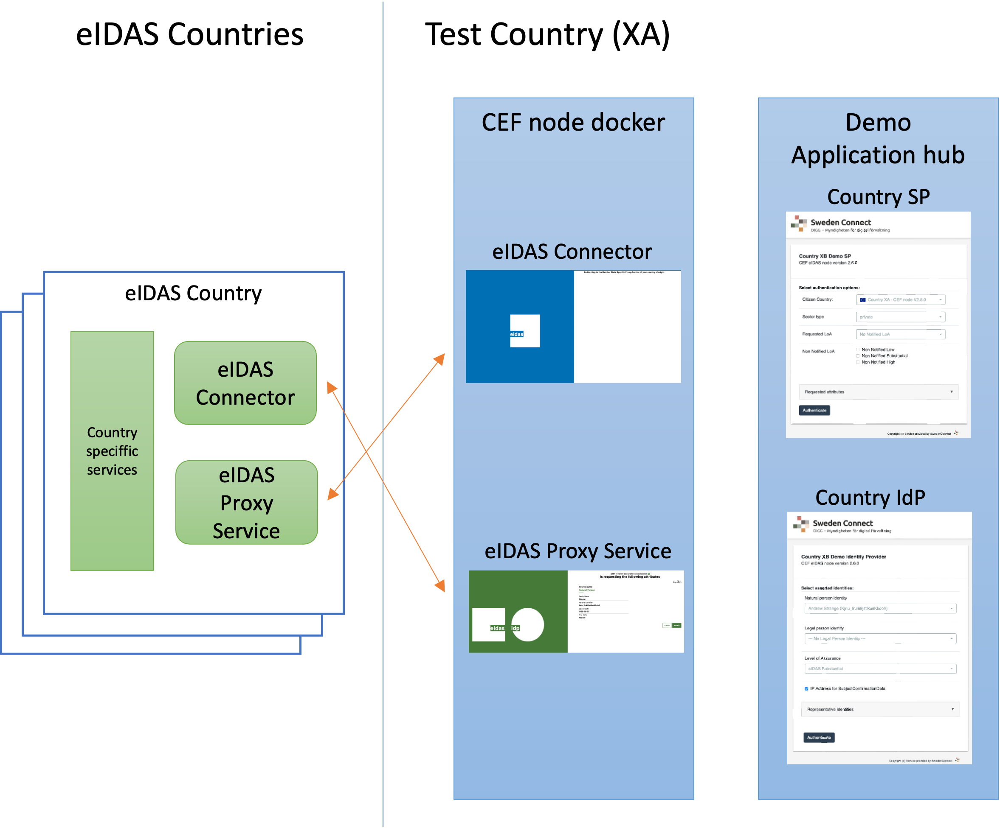

# EU eIDAS node reference implementation mockups
providing Docker images for running eIDAS nodes in a test environment
---
## Scope
This repo provide implementation components for setting up eIDAS nodes for test representing one or more demonstration countries, and to run these services as docker images.

A complete setup consists of one demo application hub (provided in the module cef-20-demo-hub) and one or more sets of national eIDAS nodes (provided by the module(s) cef-node-docker-nnn).

The current version of the node (versioni 2.7.0 pre-release) is supported by the module cef-node-docker-270. Older versions of the CEF node are available but they are not supported.

The full setup is illustrated bu the following image:


## Overview

The eIDAS nodes being setup using these application is a demo deployment of eIDAS nodes povided by the CEF integration package provided here:

> [CEF eIDAS-Node integration package](https://ec.europa.eu/digital-building-blocks/wikis/display/DIGITAL/eIDAS-Node+Integration+Package)

**Important Note:** The eIDAS nodes being setup using this project is only suitable for test and demonstration as the setup is using components that are not fit for production.

A full demo of these applications are available here: [https://cef20hub.eidastest.se/test/home](https://cef20hub.eidastest.se/test/home)

The description below describes how to setup a single CEF node version 2.7.0 pre-release supported by an SP and an IdP provided by the demo application hub service.

In short the process to build and setup such node is:

1. Build all artifacs and the CEF node tomcat server by building the module cef-node-docker-270 using the command: "mvn clean install -P buildwars"
2. Build the CEF node docker image by building the Dockerfile in the module cef-node-docker-270
3. Build the demo application hub spring boot application by building the module cef-20-demo-hub
4. Build the demo application hub docker image by using the Dockerfile in the module cef-20-demo-hub
5. Build the CEF node configuration data using the configuration builder provided in the configuration-builder module
6. Optionally configure trust data as described below to allow verification of messages from other eIDAS nodes.
7. Configure the demo application hub SP and IdP services as described below.
8. Create docker run commands with appropriate port exposure, volume mounts and environment variable settings
9. Start docker images

### CEF Digital eIDAS code and documentation
This project just provides packaging and minor modification of the EU commission reference implementation. The original code and documentation is available here: [CEF eIDAS-Nose integration package version 2.7.0 pre-release](https://ec.europa.eu/digital-building-blocks/wikis/display/DIGITAL/eIDAS-Node+PRE-Release+version+2.7).

The License of the code from CEF Digital ([European Union Public License 1.2](https://ec.europa.eu/digital-building-blocks/wikis/display/DIGITAL/eIDAS-Node+version+2.6?preview=/467109300/467109327/EUROPEAN%20UNION%20PUBLIC%20LICENCE%20v1.2.pdf) is linked on the linked page above.

## Building artifacts

The CEF node docker image depends on a number of artifacs that need to be built as follows

module | Depends on
---|---
cef-node-docker-270  | This module builds the eIDAS node Tomcat server as well as the docker image used to run the node. This module depends on the CEF node artifacts provided by the EIDAS-Sources-2.7.0-MDSL module.
EIDAS-Sources-2.7.0-MDSL  |  The eIDAS node code has been modified to use an updated version of the EIDAS-SAMLEngine in order to allow import of trusted metadata signer certificates from MDSL source as well as PEM based trust store. This modified EIDAS-SAMLEnging is provided by  [NOBID Metadata Import](https://github.com/idsec-solutions/nobid-mdimport)
Metadata Import  | Addding the capability of CEF eiDAS nodes to import trusted metadata certificates from one or more MetadataServiceList (MDSL) sources. Only depends on public repositories from maven central.


### Build instructions:

Build artifacts in the following arder (All artifacts can be build using Java 11 and higher):

>**Objective:** Build EIDAS nodes<br>
>**Location:** cef-node-docker-270<br>
>**Command:** mvn clean install -P buildwars

>**Objective:** Build EIDAS node docker image<br>
>**Location:** cef-node-docker-270<br>
>**Command:** docker build -t cef-node-docker-270 .

>**Objective:** Build EIDAS node configuration builder<br>
>**Location:** configuration-builder<br>
>**Command:** mvn clean install

>**Objective:** Build EIDAS node demo application hub Spring Boot application<br>
>**Location:** cef-20-demo-hub<br>
>**Command:** mvn clean install

>**Objective:** Build EIDAS node demo application hub docker image<br>
>**Location:** cef-20-demo-hub<br>
>**Command:** docker build -t cef-node-application-hub .


## Configuration

### Node configuration
The CEF node and the application hub must be configured with appropriate keys and configuration data.

Configuration data for the CEF node has a rather complex structure. In order to make this simpler, this repo provides a configuration builder application as a command line tool to build configuration data from a simple properties file.

Information about how to use this tool is available here: [docs/config-builder.md](docs/config-builder.md)


### Externalised trust data configuration

The original code from CEF Digital use certificates from configured key stores, holding private keys of the service, as source for all trusted certificates. This means that the sensible key stores holding the service private key must be updated and changed on a frequent basis when new eIDAS nodes are added to the list of trusted services.

In a test environments and, in particular, in production it is desirable to add trusted certificates in a separate store or PEM file. Or to import them from an MDSL source as specified by the eIDAS technical specifications.

To suppor this, the eIDAS node CEF code is exteneded using the NOBID metadata import project [https://github.com/idsec-solutions/nobid-mdimport](https://github.com/idsec-solutions/nobid-mdimport).

This GitHub repo provides the code and the instruction on how to build the trust configuration data for the CEF nodes.

### Application hub configuration

The application hub shall have a configuration directory. The location of this directory is provided by the Spring property `spring.config.additional-location` set by the environment vairable SPRING_CONFIG_ADDITIONAL_LOCATION as docker run.

A basic configuration example is provided under docs/hub-config-example. Most values here are self explanatory.

The file spconfig.properties holds the information used by the SP application. This file provides SP configuration for one or more SP countries using property name convention sp.{country code}.{property}

E.g:
> sp.XA.cefVersion=2.7.0

This means the the XA country SP application use a CEF node of version 2.7.0.

Countries this SP can connect to is listed as: sp.{node country}.country.{target country}.name and sp.{node country}.country.{target country}.flag

The name is a display name for each country that can be selected and flasg is specified as {country code}.png

This flag image is obtained from internal resources.

Not that the propety sp.{country}.requestUrl specifies the URL at the eIDAS node where the request to the eIDAS node should be forwarded. This is allways the eIDAS node URL host name + "SpecificConnector/ServiceProvider".

Test users can be speicified for the IdP as demonstrated by the user-data-XA-leal.yaml and user-data-XA-natural.yaml files.
Such user configuration files should be named exactly like this with the only difference that the country name reflects the country for this IdP.


## Environment variables
The following environment variables influence the operation of eIDAS node instances.

Environment variable | Value
---|---
EIDAS_CONNECTOR_CONFIG_REPOSITORY | The location of eIDAS connector node config files.
EIDAS_PROXY_CONFIG_REPOSITORY  | The location of eIDAS proxy node config files.
SPECIFIC_CONNECTOR_CONFIG_REPOSITORY | The location of eIDAS specific connector config files.
SPECIFIC_PROXY_SERVICE_CONFIG_REPOSITORY | The location of eIDAS specific proxy service config files (Must end with "/").
EIDAS_TRUSTED_CERTS_FILE | Optional Absolute path to a PEM file holding additional trusted certificates
MDSL_CONFIG_FOLDER  |   Optional path to a folder holding MDSL config data


## Running the docker container
The following example runs the docker container under localhost:8080 using external configuration files located at /opt/configEidas inside the container and on /opt/docker/XA/configEidas on the host

**Note:** The internal Tomcat in the docker image exposes the eidas node on port 8900

```
docker run -d --name cefnode260 --restart=always \
  -p 8080:8900 \
  -e "EIDAS_CONNECTOR_CONFIG_REPOSITORY=/opt/webapp/configEidas/connector" \
  -e "EIDAS_PROXY_CONFIG_REPOSITORY=/opt/webapp/configEidas/proxy" \
  -e "SPECIFIC_CONNECTOR_CONFIG_REPOSITORY=/opt/webapp/configEidas/specificConnector" \
  -e "SPECIFIC_PROXY_SERVICE_CONFIG_REPOSITORY=/opt/webapp/configEidas/specificProxyService" \
  -e "EIDAS_TRUSTED_CERTS_CONSTRAINTS=" \
  -e "MDSL_CONFIG_FOLDER=/opt/webapp/trust/mdsl" \
  -e "DEBUG_MODE=true" \
  -v /etc/localtime:/etc/localtime:ro \
  -v /opt/docker/configEidas20/XA-270:/opt/webapp/configEidas \
  -v /opt/docker/configEidas20/trust:/opt/webapp/trust \
  cef-node-docker-270
```

### Deploying demo application hub docker container

The following example command starts a docker container on port 8085 using external configuration files located at /opt/cef20hub inside the container and on /opt/docker/cef20 on the host

```
docker run -d --name cef20hub --restart=always \
  -p 8085:8080 -p 8015:8009 -p 8215:8000 \
  -e "SPRING_CONFIG_ADDITIONAL_LOCATION=/opt/cef20hub/" \
  -v /etc/localtime:/etc/localtime:ro \
  -v /opt/docker/cef20/hub:/opt/cef20hub \
  cef-node-application-hub
